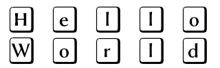

  
  <!-- alternatively consider doing
    # 
  -->

<!--
# Sections

<ul>
  <li>Mission Statement</li>
  <li></li>
  <li></li>
  <li></li>
  <li></li>
  <li></li>
  <li></li>
</ul>
-->

# Introduction

Hello world and Hello there!

This repository seeks to centralize foundational, fundamental, and functional knowledge essential to an aspiring developer's success. The contained tools, techniques, and general first-steps may vary in approach and depth similarly to the covered technologies themselves eg. open-source vs. proprietary.

This is not an oversight. Technology is perpetually evolving and advancing. Trends or modern-accepted approaches, techniques, tools, and other opinions or practices may vary heavily given a specific time, industry, the biases, education, and levels of influence of a respective community and its participating members.

Technology flourished in the absence of dogmatic values, beliefs, or other core elements. From chaos came order, Corporate Enterprises may benefit from this behavior, but __this__ _(purely intended for)_ educational-use only repository intends to remain free from such influence though they may appear occasionally. __There are no service level agreements__.

After all, you're probably here to have fun and enjoy what you're doing.

More likely this repository will only be a period piece, or gravestone, commemorating standardized workflows and automations surrounding some of my personal favorite technologies of the time(c. 2020).

All of that said, it's my hope that this repository finds its intended audience.

Furthermore, I also hope that it inspires, influences, or at least simplifies some of the associated growing pains with getting started and setup for linux, software development, DevOps, data science (or other various aspects of technology), and allows for more project development, progress, with less hassle and worry.

Other potential goals include, but may fall short of expectations:
- workflow simplification
- using currently available tools
- process documentation & management
- maintaining logical structure
- adherence to currently accepted best practices w/ respect to the language, framework, and other technologies

## __Happy Coding!__

---

**Note:** This is an independent project. While it contains links to works produced by third-parties, it does not claim ownership of those materials, and does not seek to deprive the rights' holders of any rights of ownership which they may claim under applicable federal/state, or other governing laws.

If you feel in any way that you've not been properly sourced (or attributed), please contact me directly and I'll respond at my earliest availability. Thanks!

Smiley Face =)
